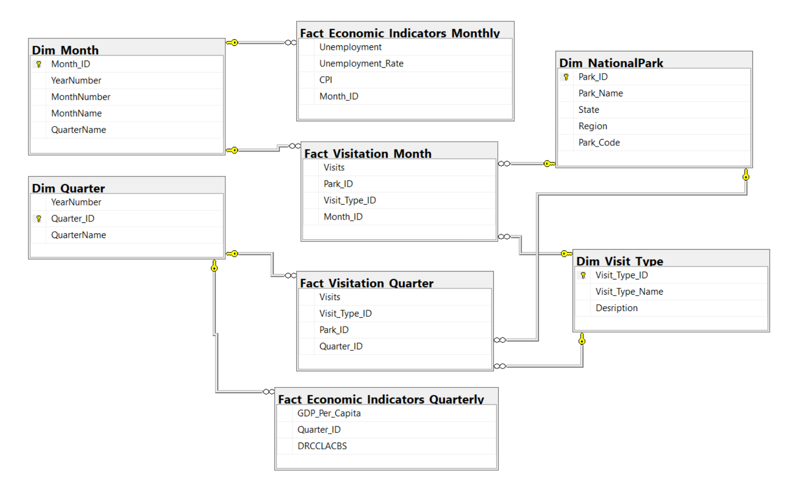

# 🏞️ SQL-ETL Pipeline for National Parks Visitation & Economic Trends Analysis

## 📘 Project Overview
This project analyzes how economic indicators influence visitation trends across all US National Parks. Using Microsoft SQL Server, national parks quarterly visitation data (e.g., recreation, non-recreation, overnight stays) is intergrated with key economic metrics like unemployment rate, GDP per capita, and the Consumer Price Index (CPI). The goal is to uncover patterns that inform strategic planning for park operations, tourism, and policymaking.

## 🎯 Objectives
- Support National Park Services (NPS) and policymakers with data-driven decisions on infrastructure, funding, and accessibility.
- Help tourism businesses and concessioners anticipate visitor trends in relation to economic cycles.
- Encourage sustainable tourism through a better understanding of economic impact on national park usage.

## ❓ Key Business Questions
1. How have park visitation rates changed over time?
2. How does the economic environment affect recreation vs. non-recreation visits?
3. Which parks show the most significant changes in visitation during downturns?
4. Do overnight stays fluctuate based on economic conditions?

## 📂 Data Sources
- **National Park Visitation Data**: [NPS.gov](https://irma.nps.gov/Stats/)
- **Economic Indicators**:
  - Kaggle datasets (Unemployment, GDP, CPI)
  - AlphaVantage API (for time-series economic data)
  - All tables used in the project are in /tables folder.
 
  ## 🛠️ Technologies Used
- Microsoft SQL Server 2019
- SQL Server Management Studio (SSMS)
- Excel (for preprocessing)
- Tableau (for visualization)

## 🗃️ Dimensional Model

This project follows a dimensional model that supports time-based analysis across economic indicators and national park visitation.

- The **fact tables** capture visitation counts and economic measurements by quarter.
- The **dimension tables** (e.g., parks, time) provide contextual data for filtering and grouping.
- The diagram below illustrates the relationships among the core tables.

## 🔗 Data Integration Process
- All datasets were transformed into a **quarterly format** for temporal consistency.
- Data was imported into Microsoft SQL Server using the import manager.
- Custom relational tables were designed with shared time identifiers to enable cross-dataset joins.
- Queries were written to explore visitation patterns in relation to economic trends.

## 🧪 Findings
- Park visitation generally **increases during stable economic periods** and **drops during major downturns** (e.g., Great Recession, COVID-19).
- **Unemployment rate and CPI** show a noticeable correlation with visitation numbers.
- **Overnight stays remain relatively stable**, with limited sensitivity to economic shifts.
- These insights can help with **resource planning**, **budget forecasting**, and **targeted outreach**.

## 🚀 Getting Started
1. Clone the repository.
2. Open SQL Server Management Studio (SSMS).
3. Run the scripts in the `sql_queries/create-tables` folder to create tables.
4. Use SSMS import manage to populate tables.
5. Execute analysis queries or connect to a BI tool for visualization.
